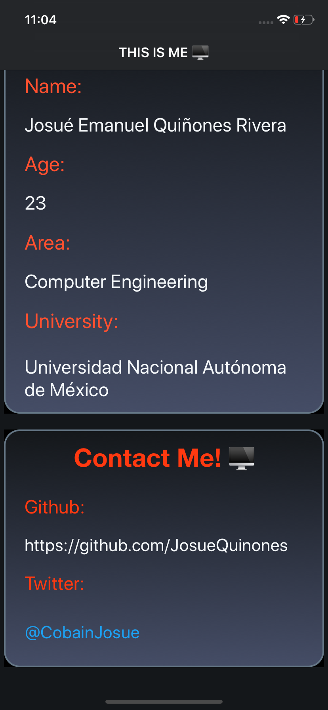

# Application for introduce me in a new professional space.

## Josué Emanuel Quiñones Rivera.

This app was made for introduce myself with anyone, like a Curriculum.

## Restrictions.

+ This app was made for iOS 12.1, to run you need Xcode 10.1.

+ The app runs on Portrait (no landscape).

## Architecture

+ Flow coordinators: The advantage for using this pattern is for the size of the app, if the app grows, the pattern can scale really good, using sub-coordinators.

---

## How the App looks like

Main info screen:

Technical Skills screen:

Soft skills screen:

Hobbies screen:

Contact screen:

